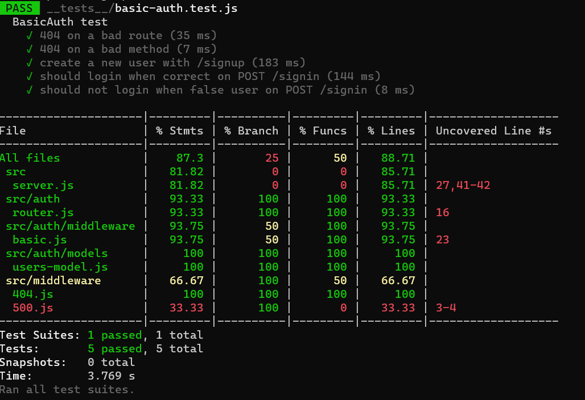
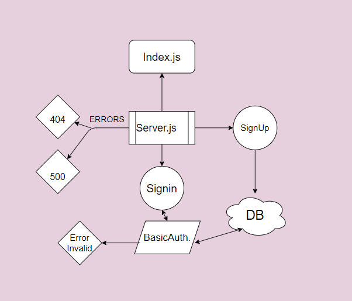

# basic-auth
### Author: Abdalrhman Albdahat
# lab4
## working branch :
- # dev links:
  - [Heroku](https://boodah96-basicauth.herokuapp.com/)
  - [GitHub-repo](https://github.com/boodah96/basic-auth)
  - [ PR ](https://github.com/boodah96/basic-auth/pull/1)
- Start work with this commands:

- `npm init -y`

- `npm i express dotenv morgan base-64 bcrypt cors mongoose`

- to test follow these command:

`npm i jest supertest @code-fellows/supergoose`
 `npm test`
 all tests work locally but I have a problem on GitHup
 
 main rotes:
/api/v1/signup
/api/v1/signin
heroku test: https://boodah96-basicauth.herokuapp.com/
UML diagram:
